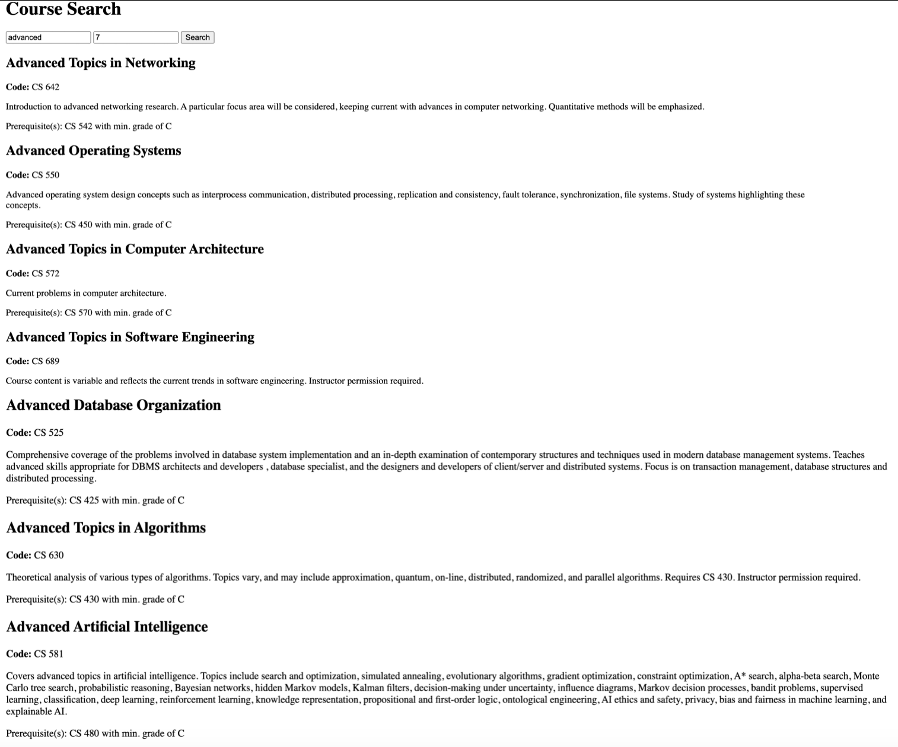
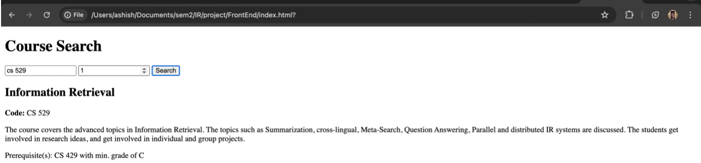
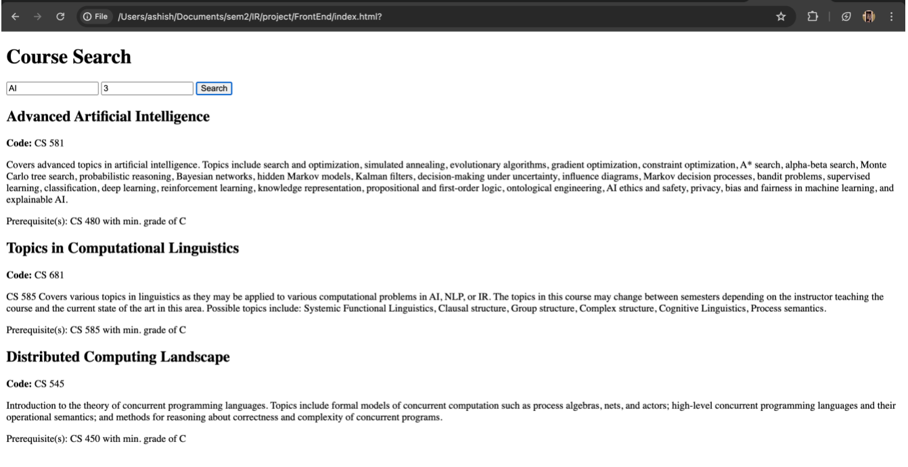

# Course Search Information Retrieval System

## Abstract

This report outlines the design and development of a Course Search Information Retrieval System specifically tailored for 500-level computer science graduate courses at Illinois Tech. The system streamlines the process of finding course information through a user-friendly web interface. Utilizing a Scrapy-based crawler to extract data, a TF-IDF indexer for creating a searchable matrix, and a Flask API to handle queries, the system offers an efficient means to search and retrieve course details, including the ability to return a user-specified number of results (k value).

## Introduction

In the digital age, accessibility to educational resources and course information is pivotal for academic planning and decision-making. The Course Search Information Retrieval System serves as an essential tool for students and faculty at Illinois Tech, providing swift and accurate access to graduate course descriptions, prerequisites, and other key details. The system aims to enhance the educational experience by facilitating informed course selection through advanced search capabilities.

## System Design

The system's architecture integrates four key components: the web crawler, the indexer, the Flask API, and the frontend interface.

- **Web Crawler**: Developed using Scrapy and BeautifulSoup, the crawler systematically navigates through the university's course bulletin, targeting 500-level CS courses. It collects course titles, codes, descriptions, and prerequisite information, ensuring comprehensive data retrieval.
- **Indexer**: Utilizing Scikit-learn's `TfidfVectorizer`, the indexer processes the collected data, generating a TF-IDF matrix that quantifies the importance of terms in the corpus of course descriptions. This matrix forms the backbone of the system's search capability.
- **Flask API**: The Flask framework processes user queries against the TF-IDF matrix, leveraging `linear_kernel` to calculate cosine similarities and rank courses accordingly. The API is designed to be flexible, accepting a custom `k` value to control the number of search results returned.
- **Frontend Interface**: A minimalistic yet functional HTML interface prompts users for search terms and the desired number of results. It communicates with the Flask API via AJAX calls, dynamically rendering the search results on the same page.

## Implementation

Each system component is meticulously implemented to ensure high performance and reliability:

- **Crawler**: Scrapy, coupled with BeautifulSoup, effectively parses HTML content, extracting relevant course data which is then serialized into JSON format for subsequent indexing.
- **Indexer**: The indexer combines course codes, titles, and descriptions into a singular text corpus for each course. It then applies the TF-IDF transformation to this corpus, creating a matrix that's serialized using pickle for persistent storage and quick access during query processing.
- **Flask API**: The Flask API serves as the intermediary between the user's frontend experience and the backend search logic. It decodes the JSON requests, invokes the search functionality, and returns the results as JSON responses.

## Testing and Results

1. Searching courses whose name has the word “advanced” with top 7 searches.
   

2. Searching course with code “cs 529”.
   
3. Searching courses whose content has “AI” with top 3 searches.
   

## Discussion

The Course Search Information Retrieval System excels in delivering quick and relevant search results, significantly enhancing the user's ability to find detailed course information. The choice of Python and its associated libraries ensures both ease of development and system performance. Limitations of the current system include reliance on static course information and a lack of real-time updates, which could be addressed in future iterations.

## Future Work

Future enhancements may include real-time data updates, natural language processing for semantic search, integration with personal academic records for tailored course recommendations, and expansion of the index to encompass a wider range of academic disciplines.

## Conclusion

The Course Search Information Retrieval System stands as a testament to the power of modern information retrieval techniques in the context of higher education. By leveraging advanced text processing and web technologies, the system provides an essential service that promotes academic growth and informed decision-making.
